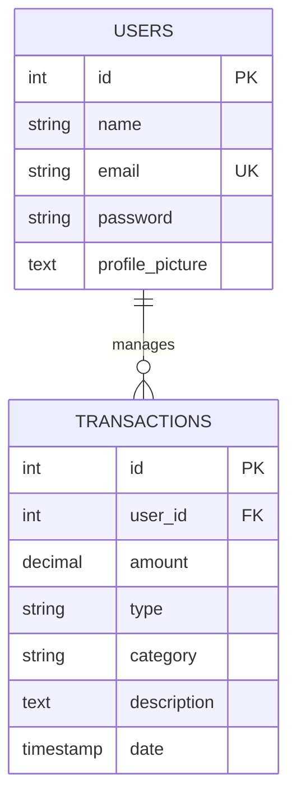

Ethio Telecom Finance Tracker: Database Schema

This document provides a detailed overview of the PostgreSQL database structure used in the Ethio Telecom Personal Finance Tracker.

---

🏗 Entity Relationship Summary

The database consists of two primary tables with a One-to-Many relationship:
- One User can have many Transactions.
- Each Transaction belongs to exactly one User.

---

📋 Table Definitions

1. `users`
Stores student/user authentication and profile information.

| Column | Type | Constraints | Description |
| :--- | :--- | :--- | :--- |
| `id` | `SERIAL` | `PRIMARY KEY` | Unique identifier for the user. |
| `name` | `VARCHAR(100)` | `NOT NULL` | Full name of the user. |
| `email` | `VARCHAR(100)` | `NOT NULL, UNIQUE` | Unique email for login. |
| `password` | `VARCHAR(255)` | `NOT NULL` | Hashed password. |
| `profile_picture` | `TEXT` | `NULL` | Base64 string or URL for profile image. |

2. `transactions`
Stores all financial records for every user.

| Column | Type | Constraints | Description |
| :--- | :--- | :--- | :--- |
| `id` | `SERIAL` | `PRIMARY KEY` | Unique identifier for the transaction. |
| `user_id` | `INTEGER` | `REFERENCES users(id)` | Foreign key linking to the user. |
| `amount` | `DECIMAL(12,2)` | `NOT NULL` | The monetary value of the record. |
| `type` | `VARCHAR(10)` | `CHECK (income/expense)` | Distinguishes between money in and out. |
| `category` | `VARCHAR(50)` | `NOT NULL` | Grouping (e.g., Food, Salary, Gift). |
| `description` | `TEXT` | `NULL` | Custom notes for the transaction. |
| `date` | `TIMESTAMP` | `DEFAULT CURRENT_TIMESTAMP` | When the transaction occurred. |

---

🔒 Data Integrity Rules
- On Delete Cascade: If a user is deleted, all their associated transactions are automatically removed to prevent orphaned data.
- Unique Constraint: The system prevents duplicate emails to ensure account security.
- Check Constraint: The `type` column only accepts 'income' or 'expense' to maintain data consistency.

---
Official Project Documentation — © 2026 Ethio Telecom
